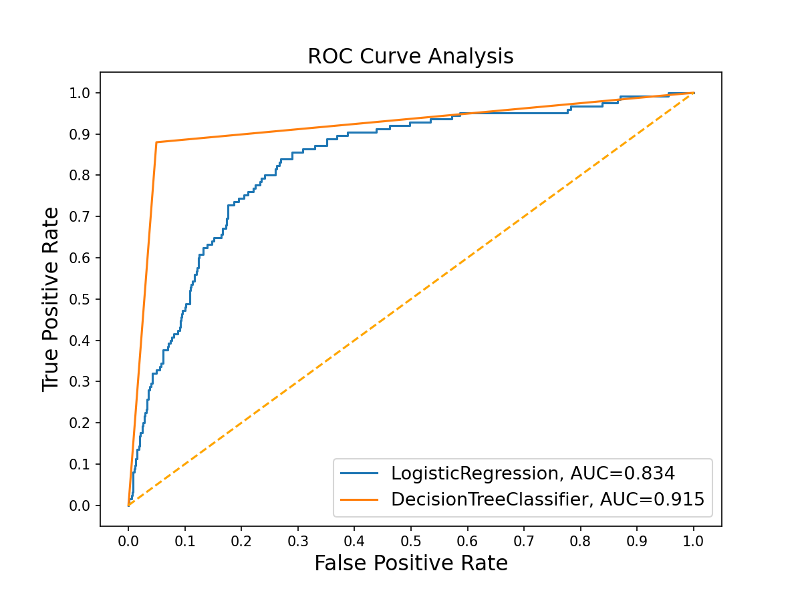

# Customer Churn Model
## Business Understanding
SyriaTel faces a high churn rate, with many customers leaving for competitors,
 impacting revenue and market share. To address this, SyriaTel aims to
 develop a churn prediction model to identify factors contributing to churn,
 reduce churn rates, increase retention, and improve profitability.
 Objectives include identifying key churn factors, accurately predicting
 at-risk customers, and enabling proactive retention strategies.
 Success metrics involve achieving a high recall score of 0.8, identifying significant
 churn factors, providing actionable insights, and demonstrating
 the model's effectiveness in improving retention and reducing revenue loss.

## Data Understanding
For this customer churn model I've meticulously utilized data from Kaggle 'Churn in Telecom's dataset'.
**Source of Data:**[Kaggle 'Churn in Telecom's dataset'](https://www.kaggle.com/datasets/becksddf/churn-in-telecoms-dataset)

## Data Preparation
The dataset contained 21 columns and 3,333 rows of data.
It contained numerical columns such as 'account length', 'area code', 'number vmail messages','total day minutes', 'total day 
calls', 'total day charge', 'total eve minutes', 'total eve calls', 'total eve charge', 'total night minutes', 'total night 
calls', 'total night charge', 'total intl minutes', 'total intl calls', 'total intl charge', 'customer service calls'.
It also contained categorical columns such as: 'state', 'phone number', 'international plan', 'voice mail plan'.
The data did not have any missing information or duplicates. The columnns that had a high correlation with the target column 
'churn' were 'total day charge', 'total eve charge', total night charge' were added into one column 'total charge'.

**Visualizations:**

## Conclusion
The Decision Tree Classifier Algorithm achieved a recall score of 91%, indicating it is a strong prediction model. To further 
reduce churn, it is recommended to reduce the number of customer service calls, provide effective training for customer service 
representatives, adjust phone plans with discounted packages, and promote the benefits of voicemail services. Offering additional 
discounts could also encourage customers to retain their contracts and attract new ones.

## More Information:
Find the full analysis in the [Jupyter Notebook](CustomerChurnModel.ipynb) or review this [presentation](CustomerChurnModelPresentation.pdf).

## Repository Structure
- Data
- Graphs
- README.md
- CustomerChurnModel.ipynb
- CustomerChurnModelPresentation.pdf

### Author: Adriana Ramirez Franco (aramirezfr20@gmail.com)

